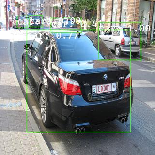
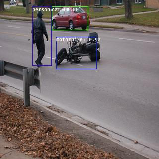

# YOLOv3

## program
* utils.py: 算術計算モジュール
* model.py: ネットワークの定義モジュール
* train.py: 学習用モジュール
* inference.py: 評価用モジュール

## 結果

## 参考
* https://arxiv.org/abs/1804.02767v1
* https://github.com/qqwweee/keras-yolo3
* https://github.com/DeNA/PyTorch_YOLOv3